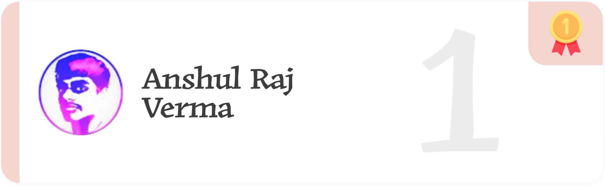
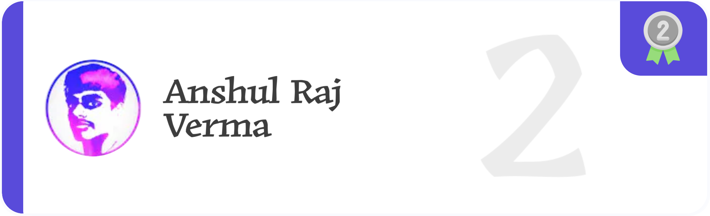
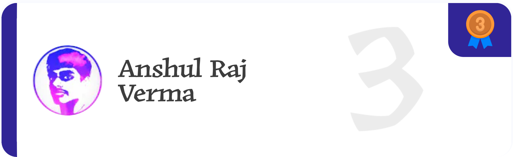
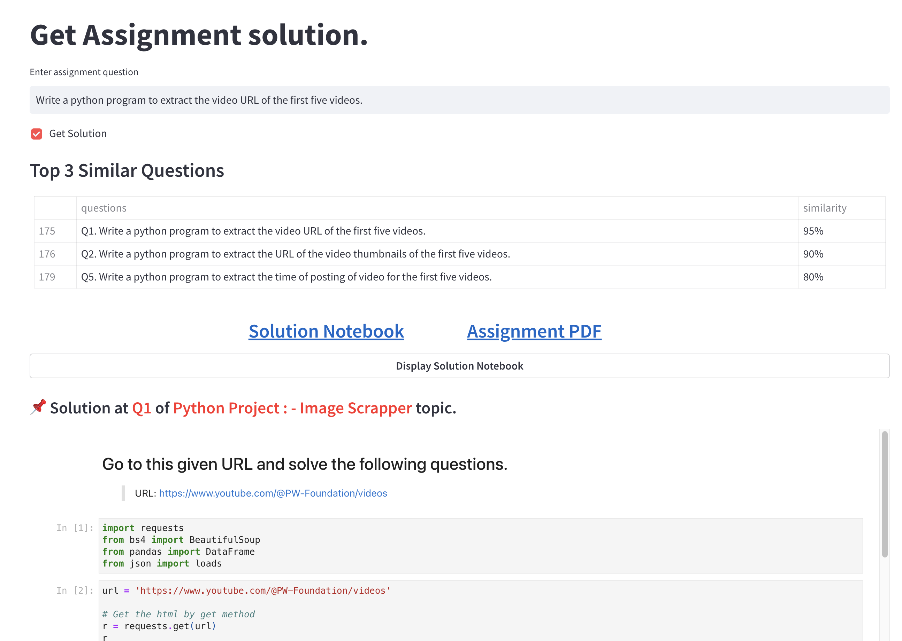
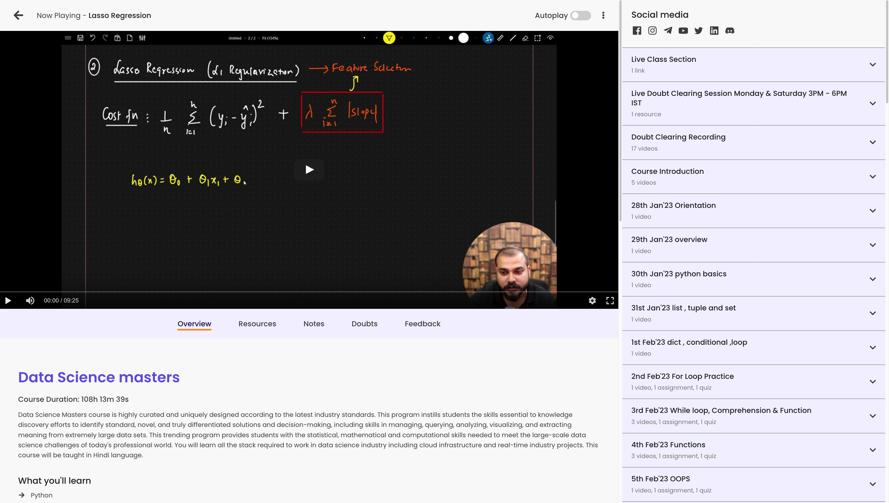
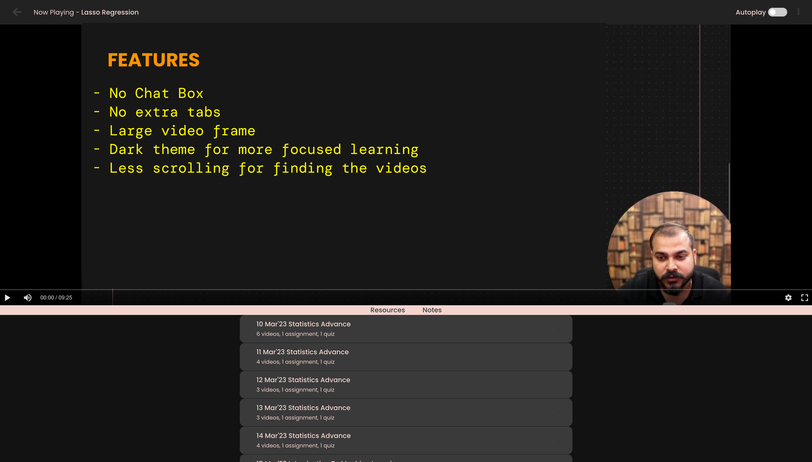

# PW Impact Batch - Hindi

This repo contains all the **assignments** present in the Impact batch. There is also some **quizzes** in the batch but it was embedded in the website.

## Table of Content

- [Assignment Leaderboard](#assignment-leaderboard-)
- [Repoistory File Structure](#repo-structure-)
- [Additional Features](#additional-features-)
  - [Automate the assignment folder creation](#automate-the-assignment-folder-creation-)
  - [Automate git commit shell command](#automate-git-commit-shell-command-)
  - [Impact Batch Assignments Solution](#impact-batch-assignments-solution)
  - [PW Courses Analysis](#pw-courses-analysis)
  - [PW Skills Experience Portal](#pw-skills-experience-portal)
  - [PW Skills API](#pw-skills-api)
  - [PW Skills Custom Theme](#pw-skills-custom-theme)
- [Creator](#created-by-arv-anshul)

## Assignment Leaderboard 🥇





## Repo Structure 📁


## Additional Features 📌

### Automate the assignment folder creation 🤖

I created a [`python script`](./utils/assignment.py) to automate the downloading of the **pdf** file from the website and add to a new folder.

```python
from datetime import date
from utils import AssignmentFolder

f = AssignmentFolder(
    date=date(2023, 3, 25),
    url="""
https://drive.google.com/file/d/1cRhT10uk6tFLe7GNF0YJJ3-U2J8vnsLp/view?usp=sharing
""",
    type='file'
)
f.make()
```

### Automate git commit shell command 🤖

I also created another [`python script`](./utils/commit_assignment.py) to **automate the git commands** to commit the **solved** assignment.

```bash
# Provide filename and commit message
python3 utils/commit_assignment.py --file-name February/07\ Feb --commit-message "Added 07 Feb assignment."
```

You can skip the commit message. _Only applicable for assignment files_.

```bash
python3 utils/commit_assignment.py --file-name February/07\ Feb

# Note:
    # The default commit message is "Added <<file_name>> assignment."
```

### Impact Batch Assignments Solution

[](https://pw-assignment-solution.streamlit.app/)

[](https://pw-assignment-solution.streamlit.app/)

### PW Courses Analysis

1. [**Courses Syllabus Analysis**](https://github.com/arv-anshul/working-with-pw-api/blob/main/analysis/_course_analysis.ipynb)
2. [**Live Courses Analysis**](https://github.com/arv-anshul/working-with-pw-api/blob/main/analysis/live_course_analysis.ipynb)
3. [**All Courses Analytics**](https://github.com/arv-anshul/working-with-pw-api/blob/main/analysis/course_analytics.ipynb): Shows the top students in their respective courses.

### PW Skills Experience Portal

See all the projects provided by PW Skills _(the projects are all same as Ineron's Internship Portal)_. This helps you to choose project in many different domain with different technology.

[](https://arv-anshul-pw-experience-portal-streamlit-app-uvuzcn.streamlit.app)
[](https://github.com/arv-anshul/pw-experience-portal)

### PW Skills API

Using **PW Skills API** I analyze all their courses in **Jupyter Notebook** and made a **streamlit app**.

[](https://arv-anshul-working-with-pw-api-app-c056zb.streamlit.app)
[](https://github.com/arv-anshul/working-with-pw-api)

### PW Skills Custom Theme

**PW Skills's web page** default theme is very bright and has many clutters like chatbot, social links bar, etc. Using this theme you can remove them and make the web page more focused towards for learning your course.

[](https://userstyles.world/style/8474/cleaned-pwskills-com)

[](https://userstyles.world/style/8474/cleaned-pwskills-com)

[](https://userstyles.world/style/8474/cleaned-pwskills-com)

> #### To use this theme you have to **change css selector** as your web page config.

## Created by [arv-anshul](https://github.com/arv-anshul)

#### Check my other works 📎

- Dashboard of **PW Skills Experience Portal** with `streamlit` and `python`. [Check here](https://github.com/arv-anshul/pw-experience-portal)

- Dashboard of **PW Skills Courses** with `streamlit` and `python`. [Check here](https://github.com/arv-anshul/pw-courses-scrapper-app)
