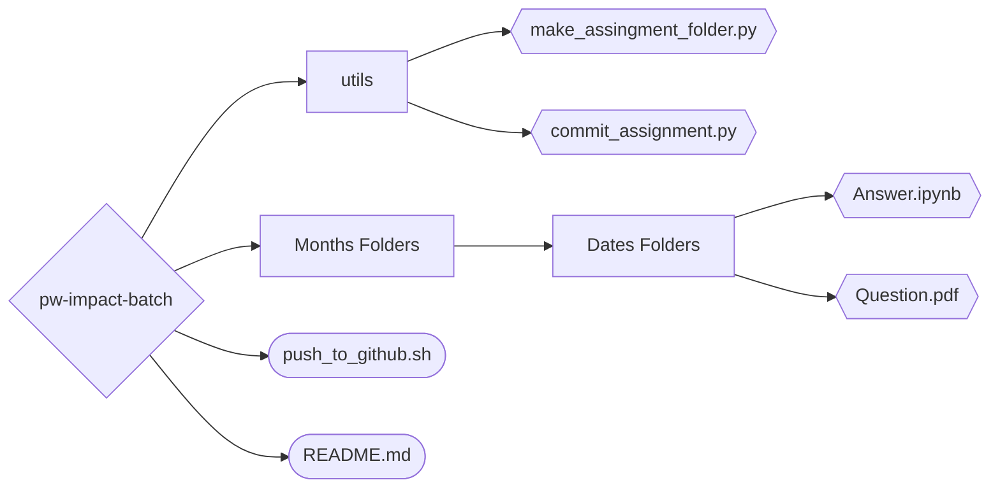

# PW Impact Batch - Hindi

This repo contains all the **assignments** present in the Impact batch. There is also some **quizzes** in the batch but it was emmbedded in the website.

## Additional

1. My repo's file structure:



1. I created a [`python script`](./utils/make_assingment_folder.py) to automate the downloading of the **pdf** file from the website and add to a new folder.

```python
from utils.make_assingment_folder import new_assignment_folder

# Add new assignment
url = 'https://drive.google.com/file/d/1dJiiIdeT3mk6REVQgTZRj_bWuJ7NwEOL/view?usp=sharing'

new_assignment_folder(url=url, date=7, month_name='February')
```

2. I also created another [`python script`](./utils/commit_assignment.py) to **automate the git commands** to commit the **solved** assignment.

```bash
# Provide fliename and commit message
python3 utils/commit_assignment.py --file-name February/07\ Feb --commit-message "Added 07 Feb assignment."
```

You can skip the commit message. _Only applicable for assignment files_.

```bash
python3 utils/commit_assignment.py --file-name February/07\ Feb

# Note:
    # The default commit messsage is "Added <<file_name>> assignment."
```

## Created by [arv-anshul](https://github.com/arv-anshul)

#### Check my other works :

- Dashboard of PW Skills experience portal with `streamlit` and `python`. [Check here](https://github.com/arv-anshul/pw-experience-portal)

- Dashboard of PW Skills courses with `streamlit` and `python`. [Check here](https://github.com/arv-anshul/pw-courses-scrapper-app)
