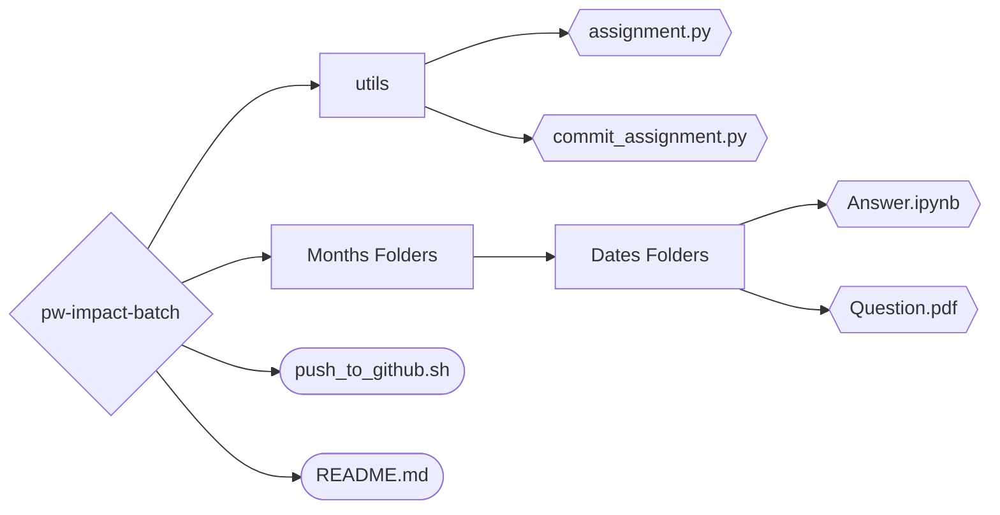

# PW Impact Batch - Hindi

This repo contains all the **assignments** present in the Impact batch. There is also some **quizzes** in the batch but it was embedded in the website.

This repo also contains a [_automation script_](./utils/assignment.py) which helps you to make [_new assignment folder_](#automate-the-assignment-folder-creation-🤖) in **no time**.

Also, automate the `git add && git commit` command with python. [Script Here](./utils/commit_assignment.py). This script add and commit the assignment and then provide you the _github repo link_\* also.

> \* For this feature you have to modify the script.

## Assignment Leaderboard 🥇


## Repo Structure 📁



## Additional Projects 📌

### Automate the assignment folder creation 🤖

I created a [`python script`](./utils/assignment.py) to automate the downloading of the **pdf** file from the website and add to a new folder.

```python
from datetime import date
from utils import AssignmentFolder

f = AssignmentFolder(
    date=date(2023, 3, 25),
    url="""
https://drive.google.com/file/d/1cRhT10uk6tFLe7GNF0YJJ3-U2J8vnsLp/view?usp=sharing
""",
    type='file'
)
f.make()
```

### Automate git commit shell command 🤖

I also created another [`python script`](./utils/commit_assignment.py) to **automate the git commands** to commit the **solved** assignment.

```bash
# Provide filename and commit message
python3 utils/commit_assignment.py --file-name February/07\ Feb --commit-message "Added 07 Feb assignment."
```

You can skip the commit message. _Only applicable for assignment files_.

```bash
python3 utils/commit_assignment.py --file-name February/07\ Feb

# Note:
    # The default commit message is "Added <<file_name>> assignment."
```

### PW Course assignment solution

> #### **Note:** This project is only done on **Data Science Masters**.

[Website Link](https://pw-assignment-solution.streamlit.app/)

[](https://pw-assignment-solution.streamlit.app/)

### PW Skills all course overview in a web page.

I perform analysis on PW all courses and turn them into web pages. Different analysis are as follows:

1. **Course syllabus or preview analysis** for each course. [Notebook Link](https://github.com/arv-anshul/working-with-pw-api/blob/main/analysis/_course_analysis.ipynb)
2. **Live course analysis** for each course. [Notebook Link](https://github.com/arv-anshul/working-with-pw-api/blob/main/analysis/live_course_analysis.ipynb)
3. **All course analytics page** which shows the Top students in their respective courses. [Notebook Link](https://github.com/arv-anshul/working-with-pw-api/blob/main/analysis/course_analytics.ipynb)

### PW Skills Experience Portal.

Using this project you can easily choose your project on the basis of difficulty, field, language, etc. [Link](https://github.com/arv-anshul/pw-experience-portal)

### PW Skills Course API analysis.

I fetches data from PW Skills API to make a web page and done some analysis with the data and turn it into a web page.

Clone the repo to see the analysis [repository link](https://github.com/arv-anshul/working-with-pw-api).

### PW Course web page custom theme.

PW Skills original theme is very light and has many clutters in it. But I removed them and make it more focused towards learning.

[](https://userstyles.world/style/8474/cleaned-pwskills-com)

[](https://userstyles.world/style/8474/cleaned-pwskills-com)

> #### To use this theme you have to **change css selector** as your web page config.

## Created by [arv-anshul](https://github.com/arv-anshul)

#### Check my other works 📎

- Dashboard of **PW Skills Experience Portal** with `streamlit` and `python`. [Check here](https://github.com/arv-anshul/pw-experience-portal)

- Dashboard of **PW Skills Courses** with `streamlit` and `python`. [Check here](https://github.com/arv-anshul/pw-courses-scrapper-app)
